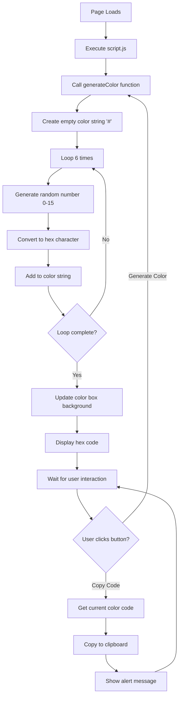

# Random Color Generator

## Workflow Diagram



## Project Description

A simple web application that generates random colors and displays them with their hexadecimal color codes. Built using vanilla HTML, CSS, and JavaScript.

## Features

- Generate random colors with a single click
- Display color visually in a colored box
- Show hexadecimal color code
- Copy color code to clipboard
- Clean and simple user interface

## Files Structure

```
random-color-generator/
├── index.html          # Main HTML structure
├── style.css           # Styling and layout
├── script.js           # JavaScript functionality
└── README.md           # Project documentation
```

## How It Works

### HTML Structure
- Container div holds all elements
- Color display box shows the generated color
- Paragraph element displays the hex code
- Two buttons for generating and copying colors

### CSS Styling
- Simple white container with border
- Centered layout with basic styling
- Green buttons with hover effects
- Responsive color display box

### JavaScript Functionality
- `generateColor()` creates random hex colors using 0-9 and A-F characters
- `copyColor()` copies the current color code to clipboard
- Automatic color generation on page load

## Usage

1. Open `index.html` in any web browser
2. Click "Generate Color" to create a new random color
3. Click "Copy Code" to copy the hex code to clipboard
4. Use the copied color code in your projects

## Technical Details

### Color Generation Algorithm
1. Define hex characters: '0123456789ABCDEF'
2. Start with '#' symbol
3. Loop 6 times to create 6-digit hex code
4. For each position, randomly select from hex characters
5. Combine all characters to form complete hex color code

### Browser Compatibility
- Works in all modern browsers
- Uses Clipboard API for copy functionality
- No external dependencies required

## Learning Objectives

This project demonstrates:
- Basic HTML structure and elements
- CSS styling and layout techniques
- JavaScript DOM manipulation
- Event handling with onclick attributes
- Random number generation
- String manipulation
- Browser APIs (Clipboard API)

## Possible Enhancements

- Add RGB and HSL color format options
- Include color palette history
- Add color name display
- Implement keyboard shortcuts
- Add color harmony suggestions
- Include accessibility features

## Getting Started

1. Download all files to a folder
2. Open `index.html` in your web browser
3. Start generating random colors!

No installation or setup required - just open and use!